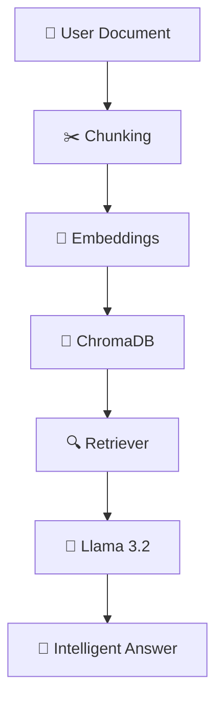

<div align="center">

# ✨ RAG Document Chatbot


<p>

</p>

<br>


</div>

---

## 🚀 Features

✨ Multi-format Document Support
🧠 Embeddings with `nomic-embed-text`
💾 ChromaDB Vector Storage
🔍 Semantic Retrieval
🤖 Llama 3.2 : 3B Integration
🌐 Streamlit Interface
📚 Detailed Summarization
💬 Question Answering

---

## ⚙️ Architecture



---

## 📂 Project Structure

```bash
📦 rag-document-chatbot
 ┣ 📜 app.py
 ┣ 📜 ingest.py
 ┣ 📜 summary.py
 ┣ 📜 chat.py
 ┣ 📂 chroma_db
 ┣ 📜 requirements.txt
 ┗ 📜 README.md
```

---

<div align="center">

### 🌟 Powered By


<br><br>


</div>
